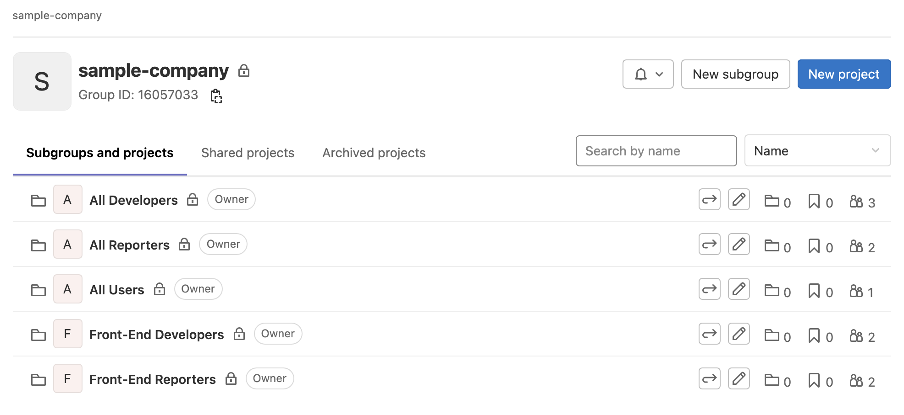

# Managing an Organization in GitLab: Groups and Users with CloudFormation

The following CloudFormation GitLab resource types can be useful to create and manage groups
and the users who belong to them. This lets infrastructure-as-code, checked in to source control,
be used to onboard- and offboard users and groups very simply.

We will use the following types:

* `GitLab::Groups::Group` - to create groups in GitLab
* `GitLab::Groups::UserMemberOfGroup` - to add users to groups
* `GitLab::Groups::GroupAccessToGroup` - to add a group of users to another group ("share" one group with another)

Typically GitLab requires that one group already exist, and new groups will be added to it.
Find or create a parent group to use in the GitLab UI, and make a note of its numeric ID.
This will be the parameter `ParentGroupId`.

We will now define a group `All Users` which will contain all company employees with GitLab access,
specifying the parent ID for this group and a path in GitLab (both required):

```
  All:
    Type: GitLab::Groups::Group
    Properties:
      ParentId: { Ref: ParentGroupId }
      Name: All Users
      Path: company-all
```

Let us now define groups `All Developers` and `All Reporters` for the developers (write access) and reporters (read access, issues, etc) respectively:

```
  AllDevelopers:
    Type: GitLab::Groups::Group
    Properties:
      ParentId: { Ref: ParentGroupId }
      Name: All Developers
      Path: company-all-developers
  AllReporters:
    Type: GitLab::Groups::Group
    Properties:
      ParentId: { Ref: ParentGroupId }
      Name: All Reporters
      Path: company-all-reporters
```

We can now add individual users to any of these groups using `GitLab::Groups::UserMemberOfGroup` and
CloudFormation's `Ref` syntax to refer to the group created above:

```
  DeveloperNakomis:
    Type: GitLab::Groups::UserMemberOfGroup
    Properties:
      GroupId: {Ref: AllDevelopers}
      Username: Nakomis
      AccessLevel: Developer
```

(Others omitted for brevity.)

Lastly we want to add the role-specific groups to the `All Users` group, using `GitLab::Groups::GroupAccessToGroup`: 

```
  AllIncludesAllDevelopers:
    Type: GitLab::Groups::GroupAccessToGroup
    Properties:
      SharedGroupId: {Ref: All}
      SharedWithGroupId: {Ref: AllDevelopers}
      AccessLevel: Developer
  AllIncludesAllReporters:
    Type: GitLab::Groups::GroupAccessToGroup
    Properties:
      SharedGroupId: {Ref: All}
      SharedWithGroupId: {Ref: AllReporters}
      AccessLevel: Reporter
```

### Try It

The complete [example code](example.yaml) is included with this documentation.
It also defines other groups, such as `FrontEndDevelopers`, and specifies the `ParentGroupId` as a parameter.
Edit the default value, then deploy this in the CloudFormation Console or at the command-line with:

```
aws cloudformation create-stack --stack-name gitlab-org-groups-and-users --template-body file://example.yaml
```

The following should then be visible in GitLab:


