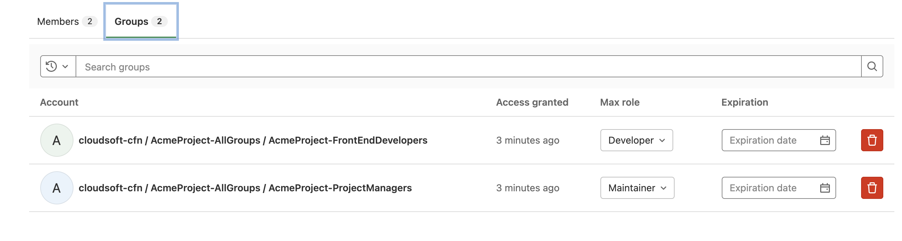
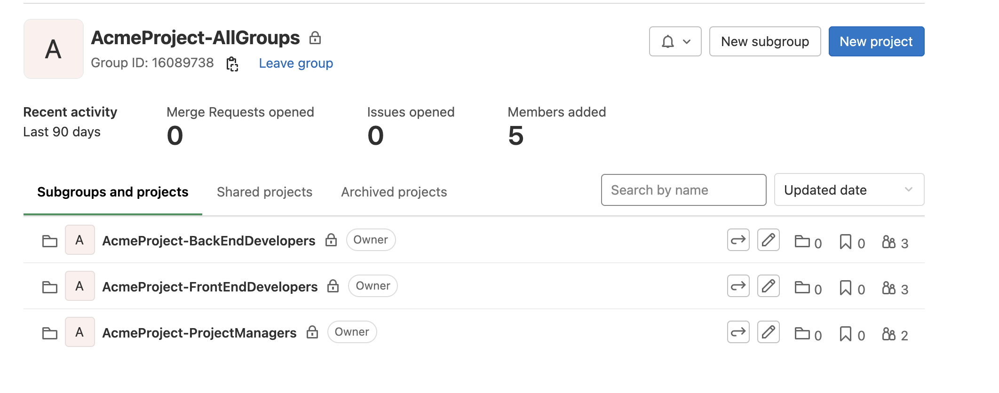

# Setting up a new project with correct users and groups

The following CloudFormation GitLab resource types allow creating projects and control users and groups of users who should be able to access them.
This allows kicking off new projects and managing users with access to the project,
simply, efficiently, and consistently.

Project build pipelines and other project-bootstrap infrastructure can also be included
as part of the CFN, so organizations can have a quick and common way to bootstrap a new project.

This demo will use the following types:

* `GitLab::Projects::Project` - to create and manage projects in GitLab
* `GitLab::Groups::Group` - to create and manage groups
* `GitLab::Groups::UserMemberOfGroup` - to specify particular members for created groups
* `GitLab::Projects::UserMemberOfProject` - to control which users can access particular projects
* `GitLab::Projects::GroupAccessToProject` - to control access of groups to a project
* `GitLab::Projects::AccessToken` - to create project-specific access tokens for use in pipelines

### Parent Group

Typically GitLab requires that one group already exist, and new groups will be added to it. Find or create a parent group to use in the GitLab UI, and make a note of its numeric ID. This will be the parameter `ParentGroupId`:
```
Parameters:
  ParentGroupId:
    Type: Number
    Default: xxx
    Description: Enter the ID of an existing group, e.g. for a "sample-company", where new groups will be created
```

### Create Projects

We can now define the set of projects required. Imagine our "Acme" project consists of a separate front-end and back-end projects, which we can define as follows:
```
  FrontEnd:
    Type: GitLab::Projects::Project
    Properties:
      Name: AcmeProject-FrontEnd
  BackEnd:
    Type: GitLab::Projects::Project
    Properties:
      Name: AcmeProject-BackEnd
```

### Create Groups of Users

We can then create groups of users with particular roles, here we will define groups: `ProjectManagers`, `FrontEndDevelopers` and `BackEndDevelopers`.
We also create a group `ProjectX` as a parent group to the ones specified above:
```
  ProjectGroups:
    Type: GitLab::Groups::Group
    Properties:
      Name: AcmeProject-AllGroups
      ParentId: { Ref: ParentGroupId }
      Path: acme-project-groups
  ProjectManagers:
    Type: GitLab::Groups::Group
    Properties:
      Name: AcmeProject-ProjectManagers
      ParentId: { Ref: ProjectGroups }
      Path: acme-project-project-managers
  FrontEndDevelopers:
    Type: GitLab::Groups::Group
    Properties:
      Name: AcmeProject-FrontEndDevelopers
      ParentId: { Ref: ProjectGroups }
      Path: acme-project-frontend-developers
  BackEndDevelopers:
    Type: GitLab::Groups::Group
    Properties:
      Name: AcmeProject-BackEndDevelopers
      ParentId: { Ref: ProjectGroups }
      Path: acme-project-backend-developers
```

### Assign Users to Groups and Projects

We can now add users to the groups created.
Note that we have admins, front and back end developers, but we also have a full stack developer who belongs to both front and back end groups:
```
  ProjectManagerMemberOfGroup:
    Type: GitLab::Groups::UserMemberOfGroup
    Properties:
      GroupId: {Ref: ProjectManagers }
      Username: cloudsoft_admin_geralt
      AccessLevel: Maintainer
  FrontEndDeveloperMemberOfGroup:
    Type: GitLab::Groups::UserMemberOfGroup
    Properties:
      GroupId: {Ref: FrontEndDevelopers }
      Username: cloudsoft_developer_ciri
      AccessLevel: Developer
  BackEndDeveloperMemberOfGroup:
    Type: GitLab::Groups::UserMemberOfGroup
    Properties:
      GroupId: {Ref: BackEndDevelopers }
      Username: cloudsoft_developer_jaskier
      AccessLevel: Developer
  FullStackDeveloperMemberOfFrontEndGroup:
    Type: GitLab::Groups::UserMemberOfGroup
    Properties:
      GroupId: { Ref: FrontEndDevelopers }
      Username: cloudsoft_developer_yennefer
      AccessLevel: Developer
  FullStackDeveloperMemberOfBackEndGroup:
    Type: GitLab::Groups::UserMemberOfGroup
    Properties:
      GroupId: { Ref: BackEndDevelopers }
      Username: cloudsoft_developer_yennefer
      AccessLevel: Developer
```

With groups populated, we can associate relevant groups with the projects.
We will use the `ProjectManagers` group for both projects with AccessLevel `Maintainer`
and relevant developers for each of the projects (with AccessLevel `Developer`):
```
  ManagersInFrontEndProject:
    Type: GitLab::Projects::GroupAccessToProject
    Properties:
      ProjectId: { Ref: FrontEnd }
      GroupId: { Ref: ProjectManagers }
      AccessLevel: Maintainer
  ManagersInBackEndProject:
    Type: GitLab::Projects::GroupAccessToProject
    Properties:
      ProjectId: { Ref: BackEnd }
      GroupId: { Ref: ProjectManagers }
      AccessLevel: Maintainer
  DevelopersInFrontEndProject:
    Type: GitLab::Projects::GroupAccessToProject
    Properties:
      ProjectId: {Ref: FrontEnd }
      GroupId: {Ref: FrontEndDevelopers}
      AccessLevel: Developer
  DevelopersInBackEndProject:
    Type: GitLab::Projects::GroupAccessToProject
    Properties:
      ProjectId: { Ref: BackEnd }
      GroupId: { Ref: BackEndDevelopers }
      AccessLevel: Developer
```

This is a tough project that needs an extra pair of hands, we want to pull a user from another team but don't necessarily need to add them to any group.
We can add users to a project directly as follows:
```
  DeveloperVesemirInFrontEndProject:
    Type: GitLab::Projects::UserMemberOfProject
    Properties:
      ProjectId: { Ref: FrontEnd }
      Username: cloudsoft_developer_vesemir
      AccessLevel: Developer
```


### Conclusion

As a result, we have a structure of our `AcmeProject`, with 2 projects created:


Our `FrontEnd` project has the developer added directly to project:


Also each of the projects has 2 groups added: `ProjectManagers` and `Front/BackEndDevelopers` respectively.


In terms of groups, we have our parent `ProjectX` group wigit th the subgroups as specified above:


Each subgroup will have the relevant users (`Developers` and `Maintainer`) present as members.